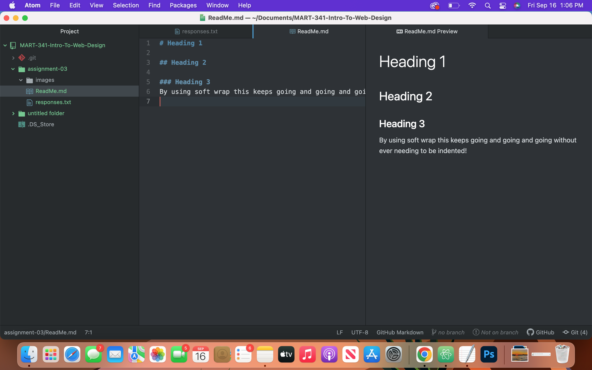

## The three things I have learned in this class so far
1. Markdown, I am slowly getting used to this new type of language.

2. I discovered how to use multiple computers using different text editing software and all of them are editing the same repository. Without causing problems!

3.I learned the importance of better naming strategies and how to organize files.

### Soft Wrap

By using soft wrap this keeps going and going and going without ever needing to be indented!

## Link to Responses
 [Responses](./responses.txt)
## Link to Screenshot
 
