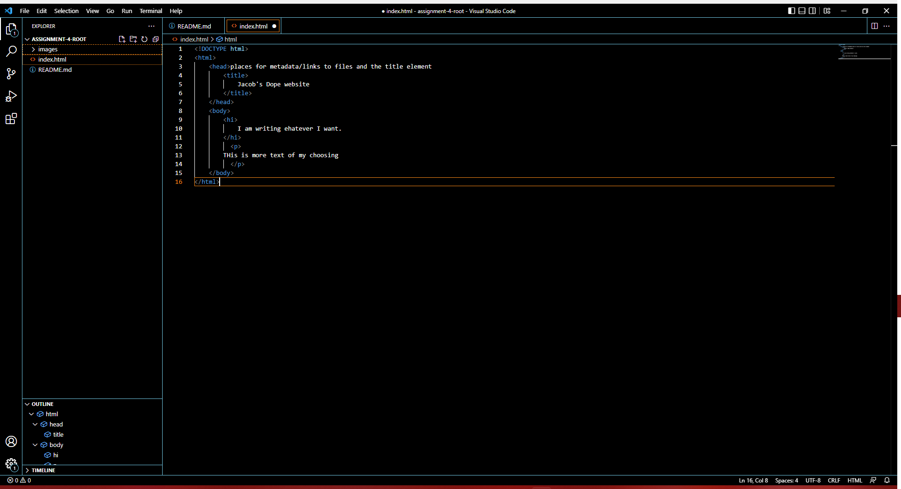

# BROWSERS <h1>

Internet browsers are a tool that allows anyone to search from files and resources posted on the internet. Here you can access pages that people have already made. Personally, I use Brave, Google Chrome and Safarai. 

## Homework Screenshot <h2>

