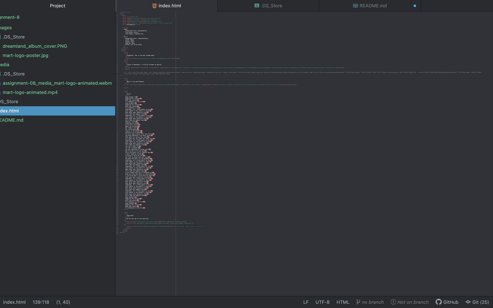

Affordances are all the actions an object can be possibly used for. Take a quarter for example, it is used to resemble $0.25 USD. It can be traded for something of equal value but a quarter can also be thrown, dropped, rolled. These are side-effects of its original creation but actions this object is capable of being used for. Websites often afford users information and typically do not have as many physical affordances.
It is easier to use a third party hosting service to post videos because they create an embed link and coding the video into your website is slightly less involved then a locally stored video. However, it is much more difficult to understand the code in the embed link so if I were to have problems with a certain link, I would struggle to correct it without help from a professor.
I followed along with the video and that made things easier for me. I learned that the quotation marks can be used differently. More specifically the '' can be used to store "". For example when the video tag required the codecs tag,  

type='video/webm; codecs="vp8.0, vorbis"'

This problem has screwed with me in the past so it is nice knowing this so that I can troubleshoot in the future with this new knowledge.

